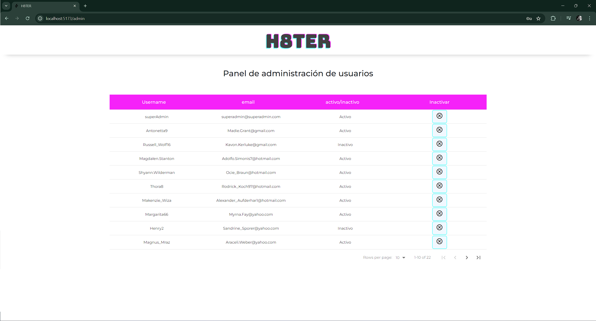

# H8ter

  

<details>
  <summary>Contenido 📝</summary>
  <ol>
    <li><a href="#objetivo-🎯">Objetivo</a></li>
    <li><a href="#sobre-el-proyecto-🔎">Sobre el proyecto</a></li>
    <li><a href="#deploy-🚀">Deploy</a></li>
    <li><a href="#stack">Stack</a></li>
    <li><a href="#instalación-en-local">Instalación</a></li>
    <li><a href="#vistas">Vistas</a></li>
    <li><a href="#funcionalidades">Funcionalidades</a></li>
    <li><a href="#futuras-funcionalidades">Futuras funcionalidades</a></li>
    <li><a href="#contribuciones">Contribuciones</a></li>
    <li><a href="#webgrafia">Webgrafia</a></li>
    <li><a href="#contacto">Contacto</a></li>
  </ol>
</details>

<details>
  <summary>Zona para profesores ℹ️</summary>
  <ol>
    <li><a href="#usuario-admin">Usuario admin</a></li>
    <li><a href="#usuario-de-prueba">Usuario de prueba</a></li>
    <li><a href="#usuario-inactivo">Usuario inactivo</a></li>
  </ol>
</details>

## Usuario superadmin: 

   ```
superadmin@superadmin.com
password: 123456789
```

## Usuario de prueba
   ```
alex@gmail.com
password: 123456789
```

## Usuario inactivo

   ```
kornetera@gmail.com
password: 123456789
```


## Objetivo 🎯
Este proyecto requería conexión a una API funcional y usar react para crear una web que conecte con la API encargada de gestionar una red social llamada H8ter.

## Funcionalidades
⚡El usuario puede crear un post tanto desde home como desde su perfil y en la vista de detalles de un post

⚡El usuario puede editar su descripción, su banner y su avatar

⚡El usuario puede borrar sus propios posts

⚡El usuario puede dar o quitar likes tanto en la vista de perfil como en la de detalle o en home

⚡En home se muestran los posts de perfiles privados

⚡El admin puede inactivar usuarios

⚡Si un usuario está inactivo no puede iniciar sesión

## Deploy 🚀
<div align="center">
    <a href="https://h8terrrss.zeabur.app/"><strong>Url a producción </strong></a>🚀🚀🚀
</div>

## Stack
<div align="center">
<a href="https://www.reactjs.com/">
    
</a>
<a href="https://developer.mozilla.org/es/docs/Web/JavaScript">
    
</a>
 </div>

## Instalación en local
1. Clonar el repositorio
2. ` $ npm install `
3. ``` $ npm run dev ```


## Vistas
Landing sin haber iniciado sesión
  
Landing sin haber iniciado sesión
  
Register

Login

Perfil de usuario

Creación de post en perfil de usuario

Creación de post en home

Vista detalle de un post

Admin


## Futuras funcionalidades
  
⬜ Comentarios y seguir a usuarios para que la vista de post en detalle sea más completa

⬜ Poder hacer peticiones de amistad a usuarios privados

⬜ Reactivar usuarios inactivos  


## Contribuciones
Las sugerencias y aportaciones son siempre bienvenidas.  

Puedes hacerlo de dos maneras:

1. Abriendo una issue
2. Crea un fork del repositorio
    - Crea una nueva rama  
        ```
        $ git checkout -b feature/nombreUsuario-mejora
        ```
    - Haz un commit con tus cambios 
        ```
        $ git commit -m 'feat: mejora X cosa'
        ```
    - Haz push a la rama 
        ```
        $ git push origin feature/nombreUsuario-mejora
        ```
    - Abre una solicitud de Pull Request


## Webgrafia:
Para conseguir mi objetivo he recopilado información y usado estas librerías:
- https://react-data-table-component.netlify.app/?path=/docs/getting-started-intro--docs
- https://mui.com/material-ui/material-icons/ y https://mui.com/
- https://github.com/motdotla/dotenv
- https://momentjs.com/
- https://reactstrap.github.io/?path=/story/home-installation--page

 

## Contacto

<a href = "mailto:aipachecogarcia@gmail.com
"></a>
<a href="https://www.linkedin.com/in/anapachecogarcia/" target="_blank"></a>
</p>
